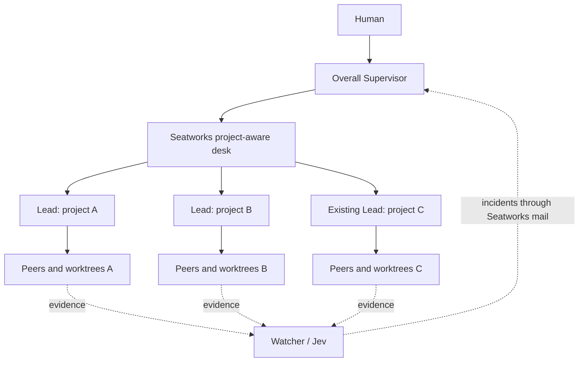

# Supervision and multi-project coordination

Source inspection: 2026-09-22. The [product baseline](../PRODUCT.md) owns the Human's
direction. This document separates observed implementation from recommendations.

## Evidence and verdict

Remote HEAD and local source agree on:

- Seatworks `v2`: [`2e11099f49eb788b8eb707c14a6f26ecd5987318`](https://github.com/sting9k/seatworks/tree/2e11099f49eb788b8eb707c14a6f26ecd5987318).
- hoangnb24/paseo-supervision `main`:
  [`1bad19b8ee6c58482494f56a3d8c6edb4f969ee1`](https://github.com/hoangnb24/paseo-supervision/tree/1bad19b8ee6c58482494f56a3d8c6edb4f969ee1).

Keep Seatworks as the implementation base. Adopt selected ideas from paseo-supervision:
host-wide recipient selection, communication-obligation assessment, conservative chronology
and stale-result suppression. Extend Seatworks's own project binding, desk and durable mail
to support cross-project control. Installing both plugins unchanged does not deliver the target.

This is source and offline-test evidence. No real Jev request, agent launch, plugin installation,
daemon restart or end-to-end delivery was performed. `npm test` in paseo-supervision passed
113 tests in four files, and `npm run typecheck` exited 0. Those tests use synthetic communication,
mocked Paseo and mocked Jev; they do not establish detector accuracy or live compatibility.

## What paseo-supervision actually provides

The plugin listens to agent creation, archive, turn-start and turn-end events. It identifies
Lead and Peer roles through configured exact provider names, then associates each Peer with
its Lead using `parentAgentId`. It does not require the two agents to share a workspace.
Cases remain separated by Lead identity. Parentless Peers and grandchildren are excluded.
Turn events can rediscover membership after reload, but do not recover missed communication.
See [communication.ts](https://github.com/hoangnb24/paseo-supervision/blob/1bad19b8ee6c58482494f56a3d8c6edb4f969ee1/server/communication.ts)
and [observer.ts](https://github.com/hoangnb24/paseo-supervision/blob/1bad19b8ee6c58482494f56a3d8c6edb4f969ee1/server/observer.ts).

The Human selects one active Supervisor through a Command Center action. Its identity is
stored in host-scoped settings. Alerts from all discovered Lead groups use that recipient;
there is no same-project filter in the observer. This is a useful cross-workspace notification
pattern, but it is not a project-scoped mandate or a control API. Selection requires the exact
provider `codex-supervisor`. No tools are registered for the Supervisor to inspect, correct,
adopt or start Leads. See [shared/supervision.ts](https://github.com/hoangnb24/paseo-supervision/blob/1bad19b8ee6c58482494f56a3d8c6edb4f969ee1/shared/supervision.ts)
and [client entry](https://github.com/hoangnb24/paseo-supervision/blob/1bad19b8ee6c58482494f56a3d8c6edb4f969ee1/index.client.tsx).

Recipient changes use prepare → persist → token-bound commit. The old route is disabled
first; stale or conflicting updates fail closed. The agent is refreshed again before delivery.
However, the server cannot restore its route until a client loads and synchronizes settings
after restart. Cases, chronology and deduplication are process-local. These are real operational
limits for unattended use. See [observer.ts](https://github.com/hoangnb24/paseo-supervision/blob/1bad19b8ee6c58482494f56a3d8c6edb4f969ee1/server/observer.ts).

## Jev integration: the useful difference

| Aspect | paseo-supervision | Seatworks |
| --- | --- | --- |
| Transport | TypeSafe `POST /v1/systemone`; configured pinned model `jev-1.13.0` | OpenRouter `/api/alpha/decisions`; catalog model `typesafe/jev-1.13` |
| Main input | Full latest brief, final Peer handback and confirmed subsequent Lead-to-Peer prompts | Bounded timeline views: actions, work, claim and instruction |
| Questions | Three Choice answers: `leadBrief`, `peerResponse`, `leadHandling` in one request | Noul probabilities grouped into one request per available view; Choice can pinpoint the relevant step |
| Primary purpose | Was an applicable communication obligation fulfilled or repaired? | Detect dangerous actions, loops, goal drift, unsupported claims and related behavior |
| Uncertainty | Local chronology/completeness gates can override a confident model answer | Missing views and configured prerequisites restrict questions; facts, thresholds and repeated readings determine findings |
| Timing | Relevant completed communication plus at most one delayed timer evaluation per case | Per-seat debouncing and repeated observation while work proceeds |
| Persistence | In-memory cases and deduplication | Persisted assessments, incidents, event log and outbox; not proof that every in-flight computation survives restart |
| Human feedback | Review prompt to selected Supervisor | Incident marking as useful/noise/unknown, calibration tooling and watch controls |

Sources: [supervision evaluator](https://github.com/hoangnb24/paseo-supervision/blob/1bad19b8ee6c58482494f56a3d8c6edb4f969ee1/server/jev.ts),
[supervision configuration](https://github.com/hoangnb24/paseo-supervision/blob/1bad19b8ee6c58482494f56a3d8c6edb4f969ee1/server/config.ts),
[Seatworks sensor](https://github.com/sting9k/seatworks/blob/2e11099f49eb788b8eb707c14a6f26ecd5987318/plugin/server/runtime/watch/jev/sensor.ts),
[sensor catalog](https://github.com/sting9k/seatworks/blob/2e11099f49eb788b8eb707c14a6f26ecd5987318/plugin/catalog/sensor/jev/sensor.json),
[views](https://github.com/sting9k/seatworks/blob/2e11099f49eb788b8eb707c14a6f26ecd5987318/plugin/server/runtime/watch/jev/views.ts),
[finding rules](https://github.com/sting9k/seatworks/blob/2e11099f49eb788b8eb707c14a6f26ecd5987318/plugin/server/runtime/watch/jev/rules.ts).

TypeSafe's official [API](https://docs.typesafe.ai/api) and
[Choice documentation](https://docs.typesafe.ai/primitives/choice) confirm the typed
state/questions/answers shape. Choice confidence is derived from the probability distribution;
it is not measured accuracy on this workflow. The two projects' configured model names and
transport credentials must not be assumed interchangeable. Their live service availability was
not tested.

The strongest behavior to carry over is obligation-based handling. If Peer A returns a blocker
and the Lead asks Peer B to resolve it, lack of a reply to A is not itself drift. A later repair
can resolve an earlier communication gap. A delay is a chance to check, not evidence that silence
is failure. Uncertain ordering prevents the system from claiming that an earlier instruction
handled a later handback. These conditions are encoded both in the questions and in local gates.
See [jev.ts](https://github.com/hoangnb24/paseo-supervision/blob/1bad19b8ee6c58482494f56a3d8c6edb4f969ee1/server/jev.ts).

## Why the observer cannot be copied unchanged

1. **Wrong communication surface.** Its extractor recognizes `paseo.send_agent_prompt` and
   `mcp__paseo__send_agent_prompt` with confirmed successful outputs. Seatworks Leads use desk
   tools through a spool, and the daemon delivers letters through its adapter. Merely changing
   provider names would leave much of the actual communication invisible. Build evidence from
   Seatworks task/ask/handback records and confirmed outbox delivery, with timeline evidence as
   a supplement. Distinguish a requested/queued message from one actually delivered.
2. **Wrong role binding.** Seatworks roles are capability data and provider aliases; the other
   plugin hardcodes a Supervisor provider and matches exact Lead/Peer providers. Reuse Seatworks
   capabilities and explicit identity bindings.
3. **Insufficient restart recovery.** Reuse and extend Seatworks state, outbox and reconciliation.
   Do not create another process-local recipient authority or a separate notification system.
4. **Scale risk.** The observer has one serialized job queue and one global evidence version.
   An event from one room can invalidate a pending judgment for another. Inference: many busy
   projects can waste evaluations or delay useful results. Use bounded concurrency and
   case-specific evidence revisions; test noisy-project isolation before claiming capacity.
5. **Silent unknown is insufficient for operations.** Suppress unsupported accusations, but show
   coverage, last successful reading, missed evidence, disabled routing and service degradation.
   A dashboard must not display healthy merely because no alert was emitted.

The relevant paths are [communication extraction](https://github.com/hoangnb24/paseo-supervision/blob/1bad19b8ee6c58482494f56a3d8c6edb4f969ee1/server/communication.ts),
[observer scheduling](https://github.com/hoangnb24/paseo-supervision/blob/1bad19b8ee6c58482494f56a3d8c6edb4f969ee1/server/observer.ts),
[Seatworks desk](https://github.com/sting9k/seatworks/blob/2e11099f49eb788b8eb707c14a6f26ecd5987318/plugin/server/desk/desk.ts)
and [mail architecture](../ARCHITECTURE.md#tool-calls-in-letters-out).

## Recommended product shape

This proposes no mandatory per-project Supervisor layer. The overall Supervisor has one
home workspace for its conversation, but a separate durable scope of supervised projects.
Each Lead retains its project/task context and engineering responsibilities. Jev supplies
evidence; it does not issue corrective commands. The Supervisor must be useful with Jev off.

### Project and agent binding

Reuse the existing project registry. `~/Projects` is a discovery location, not a synthetic
Git root containing all child repositories. Present candidate projects and bind the selected
ones. Distinguish repo identity from workspace identity and keep Git worktrees grouped by
repository. Use project-qualified lane/task identities, because every ledger can contain `L1`.
Do not select ownership by the most recently active Supervisor.

Add a durable association between the overall Supervisor, its allowed projects and actual
Lead IDs. Discovery is read-only; adopting a running Lead must explicitly record its scope,
current task and existing owner. A Lead need not be a descendant of the overall Supervisor.
For agents not launched with Seatworks tools, observation and permitted native messaging may
be possible, but full desk participation may require a safe handoff/new session: MCP tools
are creation-time configuration in the inspected Paseo 0.8 contract. Do not silently restart
or duplicate an existing Lead to make it fit.

Source boundaries to change: [caller project resolution](https://github.com/sting9k/seatworks/blob/2e11099f49eb788b8eb707c14a6f26ecd5987318/plugin/server/desk/desk.ts#L268-L275),
[project identity](https://github.com/sting9k/seatworks/blob/2e11099f49eb788b8eb707c14a6f26ecd5987318/plugin/server/desk/project.ts),
[Supervisor routing](https://github.com/sting9k/seatworks/blob/2e11099f49eb788b8eb707c14a6f26ecd5987318/plugin/server/desk/roster.ts)
and [role permissions](https://github.com/sting9k/seatworks/blob/2e11099f49eb788b8eb707c14a6f26ecd5987318/plugin/roles.json).

### Control and attention

Extend the existing desk rather than building another lifecycle service:

- Aggregate status and incidents across the bound projects, then drill into a single Lead.
- Address correction, question, reprioritization and lane creation to an explicit project/Lead.
- Validate the target and current binding again before delayed delivery. Record command identity,
  recipient, evidence revision and queued/delivered/acknowledged state.
- Keep replacement, cancellation, branch landing and cleanup distinct operations; merely
  selecting a Supervisor must not perform them.
- Represent a cross-project dependency by its producing and consuming Lead, requested artifact
  or decision, state and next checkpoint. Preserve each project's own ledger and acceptance.
- Group ordinary attention into short project summaries; let material incidents reach the
  Supervisor promptly. Bound evaluation concurrency and cost, and expose queue pressure.

An example workflow is: mobile needs an API contract from backend → Supervisor records the
dependency and asks the backend Lead for the exact artifact → backend delivers a version/ref →
Supervisor forwards it to the mobile Lead → the consumer confirms whether it unblocks work.
This is an observable coordination outcome; a green agent status alone is not one.

### Communication assessment

Add the three obligation questions as one optional assessment family alongside existing
behavioral watch. Use full relevant communication when it fits; for oversized evidence, mark
coverage incomplete or split at explicit boundaries instead of silently truncating an obligation.
Reuse incident marking and calibration. Evaluate normal communication, real missed obligations,
cross-Peer repairs, missing evidence and adversarial message text. Measure false alarms and
misses; a high model confidence or passing mocked test suite is insufficient.

Keep correction direct to the Lead and justified by evidence. Confirmed message delivery does
not prove the Lead understood or changed course; record acknowledgment and later evidence
separately. Retain prompt/case provenance without presenting embedded agent text as instructions.

## Implementation order and acceptance scenarios

1. **Runtime compatibility:** qualify against the installed Paseo 0.9.0 API or deliberately select
   a supported runtime. Both inspected plugin manifests target 0.8.x. Do not just widen the
   version range and claim compatibility.
2. **Core user need:** one Supervisor, two independent repos and two real Leads. Prove project
   discovery, explicit binding, aggregate status, targeted correction and a cross-project dependency.
3. **Existing work and durability:** bind a pre-existing Lead, reconcile archive/restore and
   Supervisor replacement, then recover routing and pending mail after restart without relying
   on a client opening. Prove that one unbound project stays outside the scope.
4. **Jev improvement:** add the communication assessment using Seatworks events/mail, evaluate
   quality and cost, and expose coverage. It must enrich an already working control path.

Focused scenarios should include duplicate `L1` IDs in separate projects; same-repo worktrees;
a Lead with no Supervisor parent; a busy/permission-blocked Lead; duplicate delivery; a recipient
archived between enqueue and send; a correction handled by a different Peer; an overlapping Lead
turn; service outage; and a noisy project that must not starve another project's alert.
These are proposed acceptance scenarios, not tests executed in this research.
